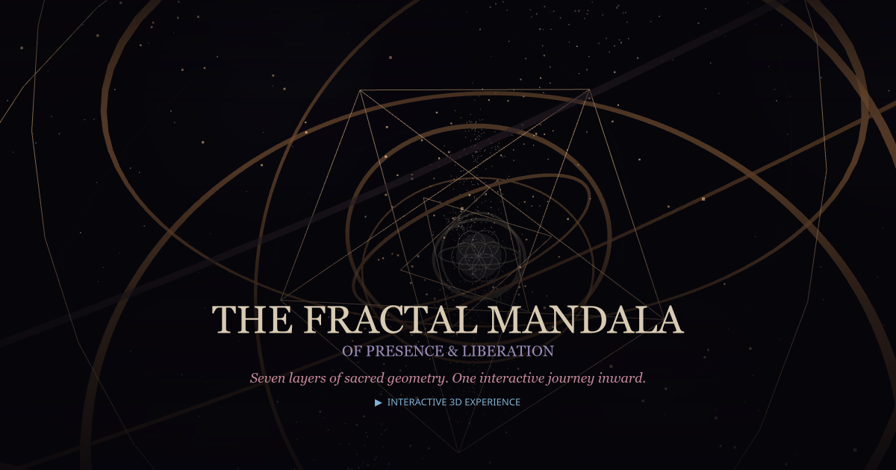

# The Fractal Mandala — Quantum Orbital Edition

> *Seven layers of sacred geometry. One interactive journey inward.*

[](https://stewalexander-com.github.io/Fractal-Mandala-3D/)

### [Enter the Mandala](https://stewalexander-com.github.io/Fractal-Mandala-3D/)

A 3D interactive sacred geometry mandala of presence and liberation. Seven concentric layers of metacognitive awareness rendered as quantum orbital shells — fly through them in your browser. Built with Three.js, set in a nebula star field.

---

## The Seven Layers (outside → core)

| Layer | Sacred Geometry | Teaching |
|-------|----------------|----------|
| 7 — Meta-Recognition | Dodecagram (12-fold) | The field clarifying itself |
| 6 — Structural Insights | Hexagonal lattice | Process, not substance |
| 5 — Key Distinctions | Octagram (8-fold) | Seeing through the pairs |
| 4 — Three Acceptances | Borromean rings | Accipio Toto, Praesentia, Ludo |
| 3 — The Practice | Pentagram (5-fold) | The fractal cycle |
| 2 — The Second Arrow | Star of David (6-fold) | First arrow / second arrow |
| 1 — Core Awareness | Seed of Life | dx/dt — this moment |

## How to Navigate

- **Scroll** or **swipe** to move between layers
- **Arrow keys** (↑↓) to fly inward / outward
- **Number keys** (1–7) to jump directly to a layer
- **Nav dots** on the right side for direct access
- Each layer reveals its teaching as you arrive

## The Core Teaching

**First arrow** = discomfort (unavoidable, natural, informational)
**Second arrow** = suffering (ego's addition, optional, constructed)
**Liberation** = seeing and releasing second arrows continuously

The practice is fractal: Meditate → Let revelation emerge → Ask questions → Release second arrows → Return. Each cycle breathes: *Inspiration → Relaxation → Awareness*.

## Tech

- Three.js (WebGL) for 3D rendering — nebula star field, volumetric cloud sprites, sacred geometry wireframes
- No build step — pure ES modules via CDN import maps
- Nebula palette: indigo-black, dusty rose, lavender, blue-star, amber dust
- Hosted on GitHub Pages

## Run Locally

```bash
# Any static server works
python -m http.server 8000
# Then open http://localhost:8000
```

---

*"You are not a noun. You are verb-ing."*

*Created with [Perplexity Computer](https://www.perplexity.ai/computer)*
